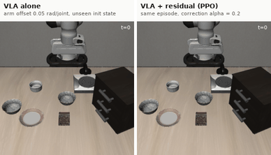

# Does a small VLA listen, and where does it break?

A robustness study of [SmolVLA](https://huggingface.co/lerobot/smolvla_libero) (450M parameters) on the
[LIBERO](https://libero-project.github.io) benchmark: a goal-level listening test, graded perturbations,
and a residual RL corrector trained on top of the frozen model.


**Paper:** [`report/paper.pdf`](report/paper.pdf) (9 pages) · short version [`report/paper_short.pdf`](report/paper_short.pdf) (4 pages)

## Findings

2,439 simulated episodes, about 29 hours on a laptop (Apple M1, 8 GB).

- **It listens, but to the exact words.** Given the instruction of another task in the same scene, the
  robot completes the task it is told in 73% of episodes and the scene's own task in 0/270. Paraphrases
  of the same instruction drop success from 80% to 23%; an empty or unrelated instruction gives 0%.
- **It breaks in different ways.** Success declines gradually with camera angle (halved around 40°),
  collapses past sharp thresholds for lighting and pixel noise, and is halved by about 3° of offset per
  arm joint at the start of an episode.
- **A residual corrector learns, but does not generalise.** PPO on top of the frozen VLA raises success on
  the starting configurations it was trained on (13–14/20 vs 10/20, three seeds) but not on held-out ones,
  where it only makes successful episodes faster.




## Setup

```bash
uv venv --python 3.12 .venv && source .venv/bin/activate
uv pip install -e ".[libero,dev]"          # Linux
```

On macOS, `hf-libero` pulls `egl-probe`, which does not build and is not needed. Install LIBERO without it:

```bash
uv pip install "lerobot[smolvla,dataset]==0.6.1"
uv pip install --no-deps hf-libero==0.1.4 robosuite==1.4.0 bddl==1.0.1
uv pip install "hydra-core>=1.2,<1.4" easydict cloudpickle future numba
uv pip install --no-deps -e . && uv pip install pytest==8.3.4
```

`MUJOCO_GL` is set automatically (`egl` on Linux, `cgl` on macOS). For a Colab or Kaggle GPU, use
[`notebooks/runner.ipynb`](notebooks/runner.ipynb).

## Usage

```bash
python -m vla_stress.evaluate --config configs/baseline_spatial.yaml --smoke   # 1 episode, quick check
python -m vla_stress.evaluate --config configs/language_matrix.yaml            # one experiment
bash scripts/reproduce.sh                                                      # everything, then figures and PDFs
pytest
```

Each episode is one CSV row in `results/` (config, seed, commit, versions, device), and runs resume where
they stopped. Episode *e* always starts from LIBERO initial state *e* with seed *e*, so conditions are
compared on identical episodes. Every number in the paper is generated from these files by
`scripts/make_figures.py` and `scripts/make_tables.py`.

## Layout

```
configs/            one YAML per experiment (videos/ for the rollout montages)
src/vla_stress/     evaluation loop, perturbations, residual RL (PPO), statistics and plots
scripts/            figures, tables, videos, reproduce.sh
results/            per-episode CSVs and summary tables
runs/               trained residual correctors and PPO logs
report/             LaTeX sources and PDFs
docs/               working journal (in French), notes for LeRobot
```
