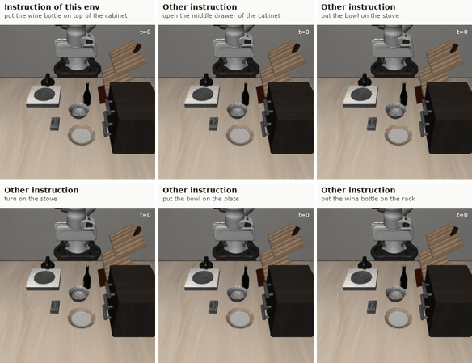
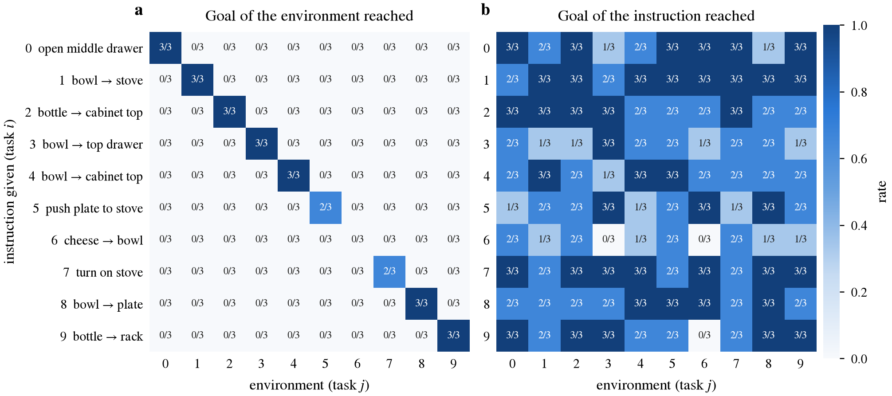
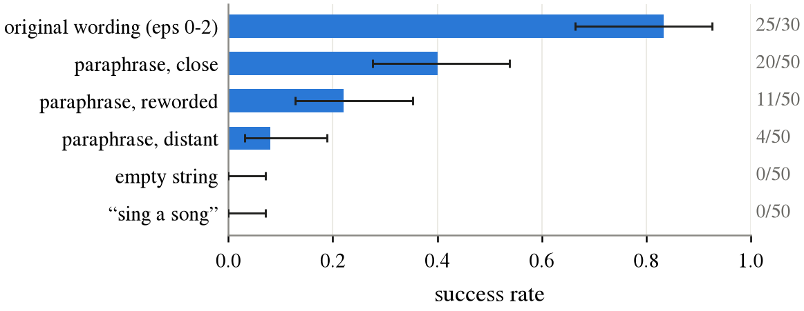
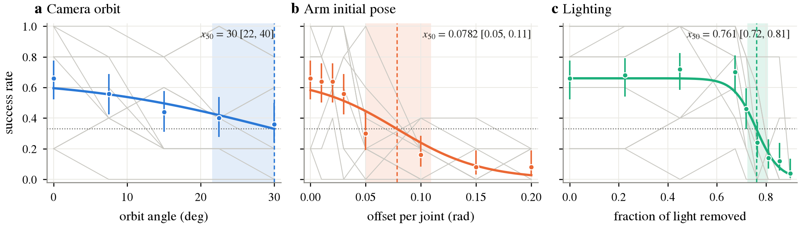
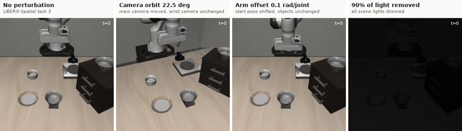
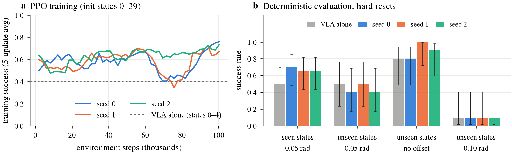

# vla-stress-test

Where and how does a small vision-language-action model break? A robustness study of
[SmolVLA](https://huggingface.co/lerobot/smolvla_libero) on the LIBERO benchmark, and an attempt to fix
one weakness with residual RL without touching the VLA.



*Same LIBERO-Goal scene, six different instructions: the robot does what it is told, not what the scene
usually asks for.*

**Report:** [`report/main.pdf`](report/main.pdf) (4 pages). **Notes:** [`docs/JOURNAL.md`](docs/JOURNAL.md) (in French).

## Main results

About 2,400 simulated episodes, all run on a laptop (Apple M1, 8 GB). Every number below is read from
`results/summary/`; intervals are Wilson 95%.

1. **It listens, but to the exact words.** Given the instruction of another LIBERO-Goal task, the robot
   never completes the environment's own task (0/270) and reaches the goal it was told in 197/270
   episodes (73%). Hand-written paraphrases of the *same* instruction drop success from 40/50 to 35/150
   (23%), and an empty or unrelated instruction gives 0/50.
2. **It breaks in different ways.** Success decreases gradually with camera viewpoint (halved around
   40°), falls past sharp thresholds for lighting (no effect until 67% of the light is removed) and pixel
   noise, and is halved by an offset of about 0.05 rad (3°) per arm joint at the start of an episode.
3. **A residual corrector learns, but does not generalise.** PPO on top of the frozen VLA raises success
   on the initial states it was trained on (14/20 and 13/20 vs 10/20) but not on held-out ones, and mostly
   learns to finish successful episodes faster.

| | |
|---|---|
|  |  |





*Same episode under each perturbation (main camera view).*



## How it works

- **Evaluation** (`src/vla_stress/evaluate.py`): one CSV row per episode with config, seed, git commit,
  LeRobot version, checkpoint revision and device. Runs are resumable. Episode *e* of a task always uses
  LIBERO initial state *e* and seed *e*, so conditions are compared on identical episodes (paired tests).
  The policy goes through LeRobot's own processors loaded from the checkpoint; a cross-check with
  `lerobot-eval` gives 14/20 where this loop gives 12/20 on the same tasks.
- **Listening test**: all ten LIBERO-Goal tasks share the same objects, so every task's goal predicate is
  evaluated at every step, whatever environment is running.
- **Perturbations** (`src/vla_stress/perturbations.py`): camera orbit about the point the camera looks at,
  joint offsets of the arm after reset, scaling of every light, pixel noise, camera masking. Each takes an
  intensity in [0, 1] mapped to a physical unit.
- **Breaking point**: logistic fit with the baseline fixed, plus a model-free estimate (isotonic +
  interpolation), both with a bootstrap over tasks.
- **Residual RL** (`src/vla_stress/residual_rl/`): MLP on proprioception + VLA action, last layer
  initialised to zero (checked: identical to the VLA alone, episode by episode), single-file PPO, four
  simulators sharing batched VLA calls.

## Setup

```bash
uv venv --python 3.12 .venv && source .venv/bin/activate
uv pip install "lerobot[smolvla,dataset]==0.6.1"
# Linux
uv pip install -e ".[libero,dev]"
# macOS: hf-libero depends on robomimic -> egl-probe, which does not build on macOS.
# LIBERO itself does not need it, so install it without dependencies:
uv pip install --no-deps hf-libero==0.1.4 robosuite==1.4.0 bddl==1.0.1
uv pip install "hydra-core>=1.2,<1.4" easydict cloudpickle future numba
uv pip install --no-deps -e . && uv pip install pytest==8.3.4
```

`MUJOCO_GL` is set automatically (`egl` on Linux, `cgl` on macOS). On a Colab or Kaggle GPU, use
`notebooks/runner.ipynb`.

## Reproducing

```bash
python -m vla_stress.evaluate --config configs/baseline_spatial.yaml --smoke   # 1 episode, 60 steps
python -m vla_stress.evaluate --config configs/language_matrix.yaml            # any config in configs/
bash scripts/run_queue.sh configs/dose_*.yaml                                  # several in a row
python -m vla_stress.residual_rl.ppo --task 2 --perturbation robot_init --intensity 0.25 \
    --n-envs 4 --rollout-steps 512 --total-steps 100000 --seed 0 --run-dir runs/robot025_task2_s0
python scripts/make_figures.py          # figures, summary tables and report/numbers.tex
python scripts/record_rollouts.py --spec media/specs/language.yaml
cd report && latexmk -pdf main.tex
pytest                                  # stats + perturbation tests
```

## Layout

```
configs/              one YAML per experiment
src/vla_stress/
  env_utils.py        policy loading, LIBERO env, one rollout, goal predicates
  perturbations.py    graded perturbations
  evaluate.py         resumable evaluation loop -> CSV
  residual_rl/        env wrapper, actor-critic, PPO
  analysis/           Wilson intervals, dose-response fits, plots
scripts/              figures, videos, throughput, queues
results/              raw CSVs (one row per episode) and summary/
media/                GIF / MP4 rollouts
report/               LaTeX source and PDF; numbers.tex is generated from results/
docs/                 journal, notes for LeRobot
```

## Related work

LIBERO-plus (arXiv 2510.13626) and LIBERO-PRO (arXiv 2510.03827) perturb LIBERO along many axes at
fixed levels. This project looks at fewer axes with a continuous intensity, adds a goal-level listening
test, and tries a residual correction.

## Limitations

Simulation only, one model and one checkpoint, 3 to 10 episodes per cell. The measured baselines (59% on
LIBERO-Spatial, 84% on LIBERO-Goal) are below those reported for SmolVLA, so conclusions are relative to
them.
